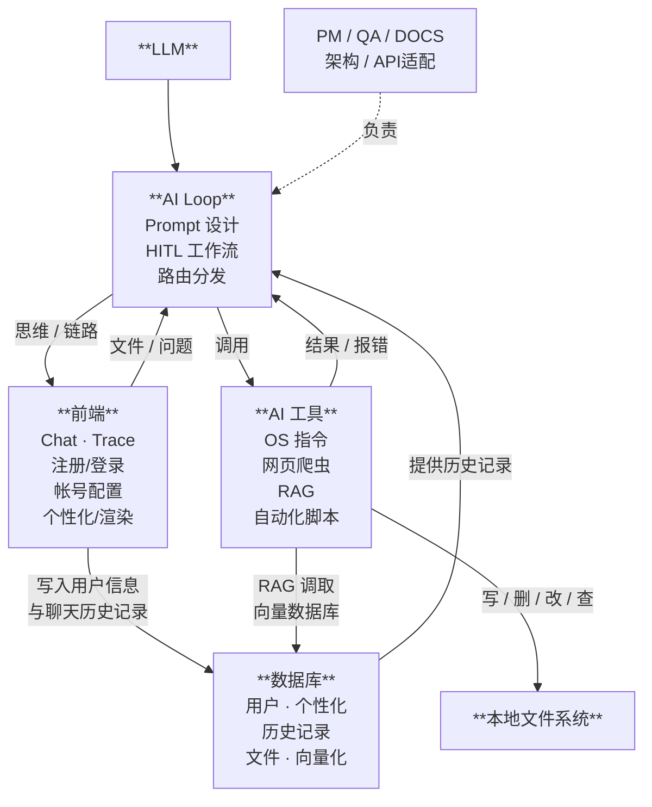

# Student Productivity Agent — 整体架构图

```mermaid
flowchart TD
    LLM["**LLM**"]
    PM["PM / QA / DOCS\n架构 / API适配"]

    Frontend["**前端**\nChat · Trace\n注册/登录\n帐号配置\n个性化/渲染"]

    Loop["**AI Loop**\nPrompt 设计\nHITL 工作流\n路由分发"]

    Tools["**AI 工具**\nOS 指令\n网页爬虫\nRAG\n自动化脚本"]

    DB["**数据库**\n用户 · 个性化\n历史记录\n文件 · 向量化"]

    FS["**本地文件系统**"]

    LLM --> Loop
    PM -. "负责" .-> Loop

    Frontend -- "文件 / 问题" --> Loop
    Loop -- "思维 / 链路" --> Frontend

    Loop -- "调用" --> Tools
    Tools -- "结果 / 报错" --> Loop

    Frontend -- "写入用户信息\n与聊天历史记录" --> DB
    DB -- "提供历史记录" --> Loop

    Tools -- "RAG 调取\n向量数据库" --> DB

    Tools -- "写 / 删 / 改 / 查" --> FS
```
