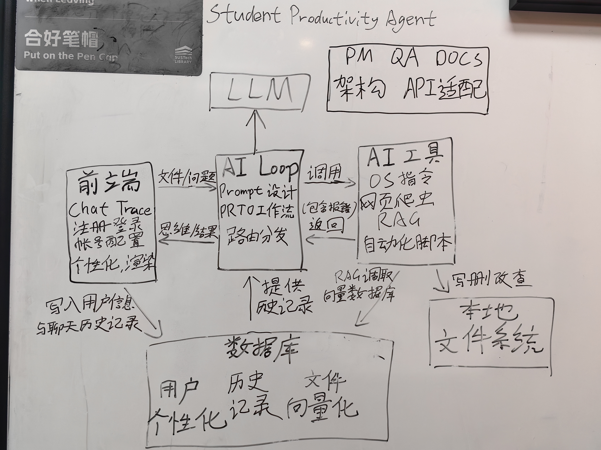
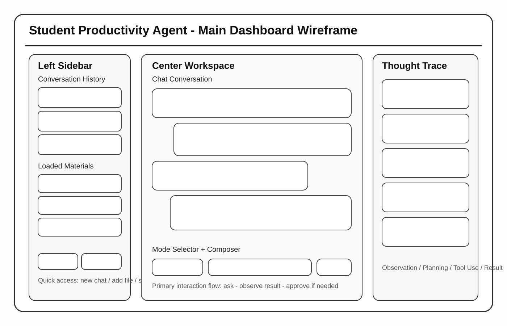
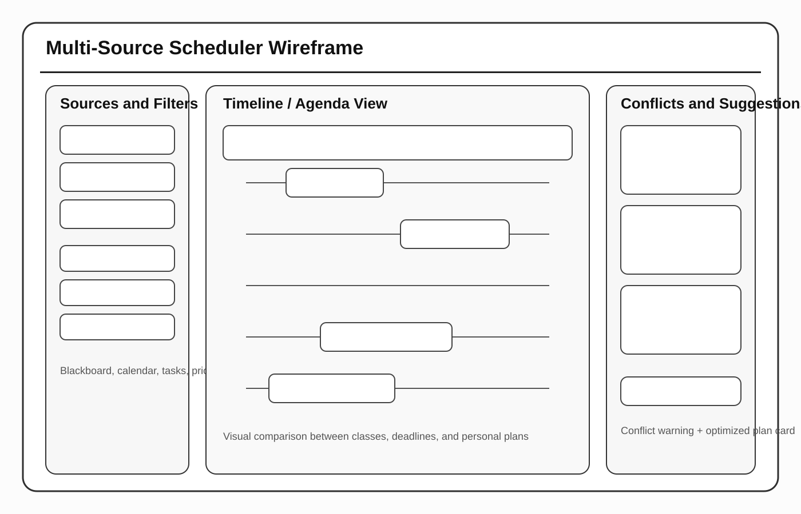
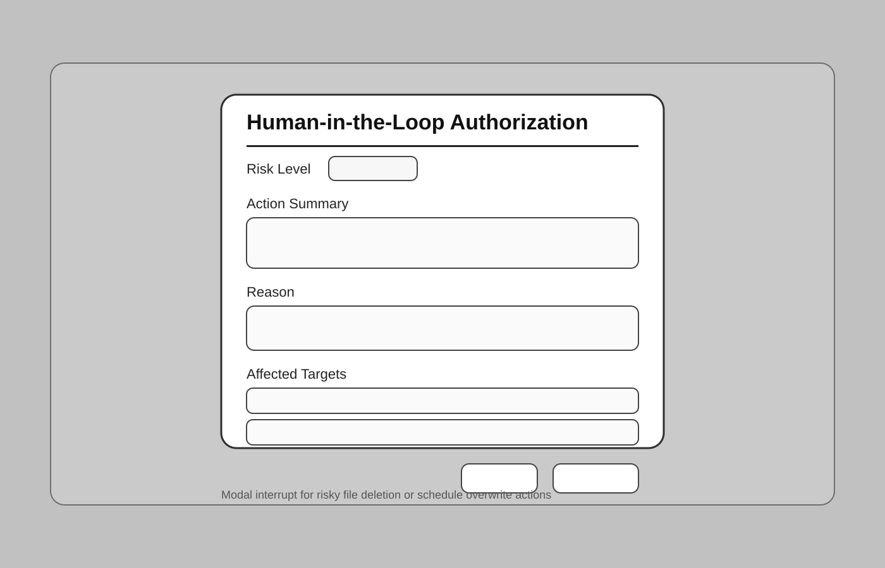

## 1. Architecture Design

### 1.1 Architectural Pattern: Monolithic Layered Architecture
The Student Productivity Agent (SPA) follows a **Monolithic Layered Architecture** within a **Client-Server RESTful** framework. This design ensures a strict separation of concerns through clearly defined tiers, as illustrated below.

*   **Presentation Layer (Client)**: A state-of-the-art `PyQt6` desktop application. It is responsible for UI rendering, user interaction, and progressive display of reasoning traces. **Crucially, the Presentation Layer has no direct access to the database**; it relies entirely on the backend services for all data persistence and retrieval.
*   **Service & Business Layer (Backend)**: A monolithic `FastAPI` application that encapsulates all intelligence and data logic. It serves as the gateway for the frontend, providing secure RESTful endpoints that manage everything from specialized Student Services (Scheduler/RAG) to the core Agentic reasoning loop.
*   **Data Layer**: Comprising PostgreSQL and ChromaDB, managed exclusively by the backend to ensure data integrity and security.

### 1.2 Selection Rationale
This **Layered Architecture** was selected for its balance between complexity and implementability in a sprint-based development environment.

1.  **Security via Encapsulation**: Since the **Frontend relies on the Backend for database communication**, sensitive student credentials (like CAS passwords) and LLM API keys are never exposed on the client side. They are securely encrypted and managed within the Service Layer.
2.  **Monolithic Simplicity**: Choosing a monolithic backend (rather than microservices) allows for rapid development and easier deployment during the early sprints, while the internal layering ensures the codebase remains maintainable.
3.  **Concurrency & Non-blocking Logic**: By leveraging **asynchronous processing** in FastAPI and **multi-threading** in PyQt6, the system achieves high concurrency. Offloading heavy reasoning tasks and web scraping to the backend ensures a non-blocking experience where the user interface remains fully responsive and "unfrozen" even during parallel background operations.

### 1.3 System Component Details

#### The Agentic Loop (PydanticAI)
The "brain" of the system is the Agentic Loop implemented via `PydanticAI`. Unlike traditional hardcoded logic, the Agent operates in a dynamic cycle:
*   **Perception**: The Agent receives a JSON payload containing the user's message and session context.
*   **Reasoning**: Utilizing the `deepseek-chat` model, the Agent analyzes the intent and plans a sequence of actions.
*   **Tool Execution**: The Agent autonomously selects from a suite of tools (Scheduler, RAG Search, OS Automation). Tools are injected with necessary dependencies (e.g., DB sessions) via the `AgentDeps` pattern.
*   **Observation**: The output of the tools is fed back into the LLM, allowing for self-correction or multi-step execution before returning the final response.

#### Data Persistence Model
The system employs a dual-database strategy for diverse data requirements:
*   **Relational Database (PostgreSQL)**: Manages five core tables:
    *   `users`: Stores credentials, preferences, and encrypted keys.
    *   `chat_sessions` & `chat_messages`: Ensures full persistence of conversation history across devices.
    *   `materials`: Metadata for uploaded academic resources.
    *   `audit_logs`: A transaction ledger for all OS-level operations, ensuring traceability for the HITL mechanism.
*   **Vector Database (ChromaDB)**: Implements subject-based sharding across 21 collections (e.g., `cs`, `math`, `policy`). This optimizes retrieval speed and accuracy for the Campus Encyclopedia (RAG) feature.

---

## 2. UI Design for Student Productivity Agent

This concise UI design package focuses on the four primary feature interfaces of the Student Productivity Agent. It is intended for report submission and is kept separate from the implemented frontend.

### Why These 4 Screens

These four wireframes cover the most distinctive and important features of the project:

1. Main Dashboard
2. Multi-Source Scheduler
3. Campus Encyclopedia
4. Human-in-the-Loop Authorization

Common pages such as login and registration are omitted because they are generic interfaces rather than the notable interfaces of this project.

### 2.1 Main Dashboard

Purpose:
- Core workspace of the system
- Integrates conversation history, loaded materials, main chat area, and Thought Trace
- Reflects the requirement that conversation and reasoning should be visually separated

### 2.2 Multi-Source Scheduler

Purpose:
- Displays calendar data, Blackboard deadlines, and personal tasks
- Highlights conflicts and supports schedule optimization

### 2.3 Campus Encyclopedia

Purpose:
- Provides RAG-based campus question answering
- Emphasizes answer readability, citations, and source transparency

### 2.4 Human-in-the-Loop Authorization

Purpose:
- Acts as the safety checkpoint for risky operations
- Forces explicit user confirmation before destructive or sensitive actions

### Summary

This concise UI design package captures the core interaction model of the system:

- chat-first dashboard
- schedule planning workspace
- knowledge retrieval workspace
- explicit authorization modal for risky actions

These wireframes are low-to-mid fidelity design outputs for communication and report presentation, not screenshots of implementation.
