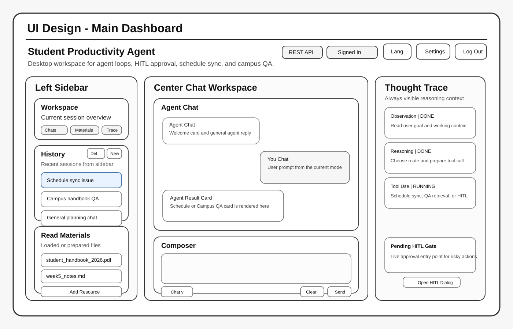
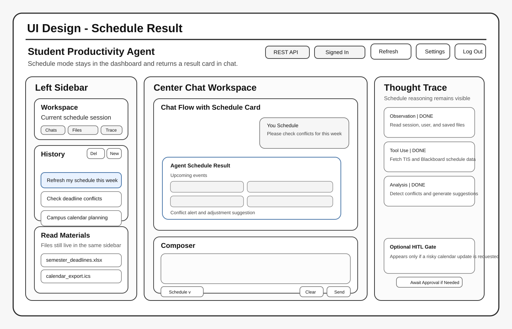
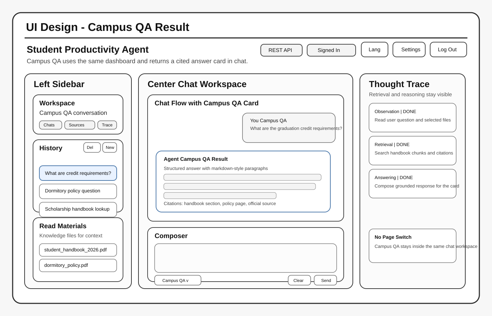
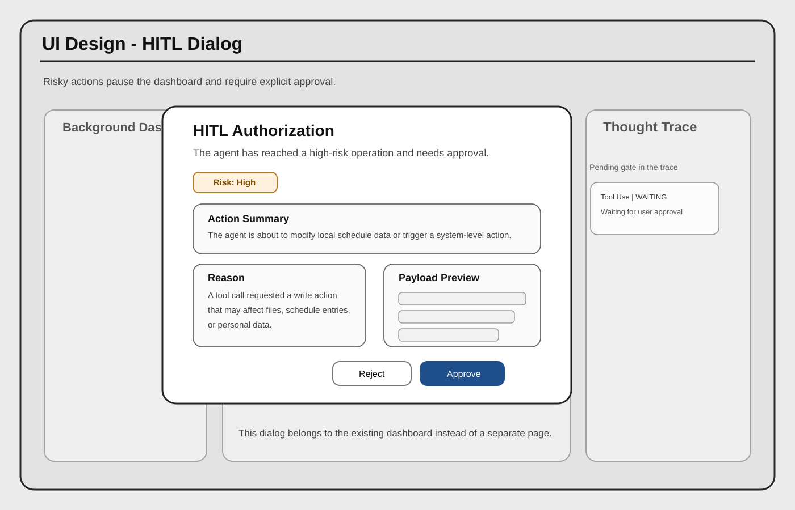
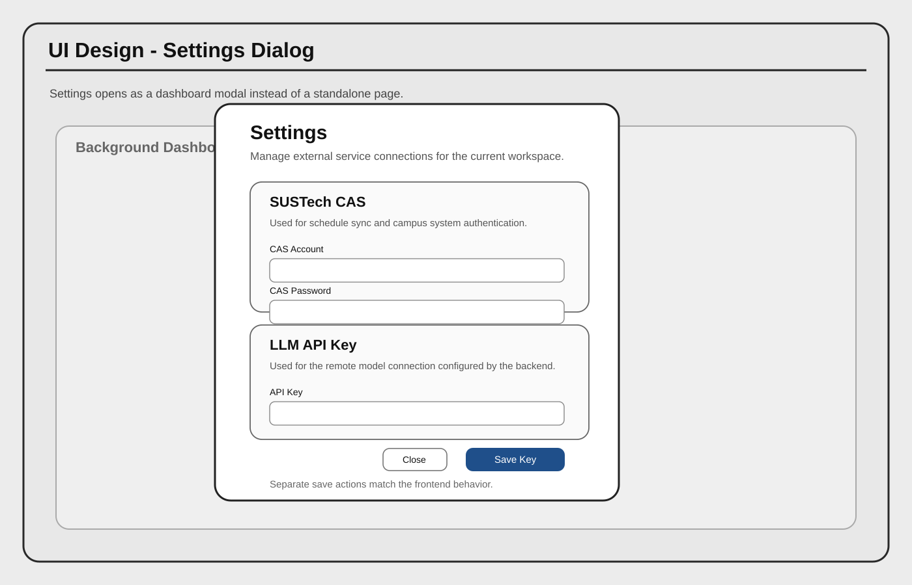

## 1. Architecture Design

### 1.1 Architectural Pattern: Monolithic Layered Architecture
The Student Productivity Agent (SPA) follows a **Monolithic Layered Architecture** within a **Client-Server RESTful** framework. This design ensures a strict separation of concerns through clearly defined tiers, as illustrated below.

.jpg)

*   **Presentation Layer (Client)**: A state-of-the-art `PyQt6` desktop application. It is responsible for UI rendering, user interaction, and progressive display of reasoning traces. **Crucially, the Presentation Layer has no direct access to the database**; it relies entirely on the backend services for all data persistence and retrieval.
*   **Service & Business Layer (Backend)**: A monolithic `FastAPI` application that encapsulates all intelligence and data logic. It serves as the gateway for the frontend, providing secure RESTful endpoints that manage everything from specialized Student Services (Scheduler/RAG) to the core Agentic reasoning loop.
*   **Data Layer**: Comprising PostgreSQL and ChromaDB, managed exclusively by the backend to ensure data integrity and security.

### 1.2 Selection Rationale
This **Layered Architecture** was selected for its balance between complexity and implementability in a sprint-based development environment.

1.  **Security via Encapsulation**: Since the **Frontend relies on the Backend for database communication**, sensitive student credentials (like CAS passwords) and LLM API keys are never exposed on the client side. They are securely encrypted and managed within the Service Layer.
2.  **Monolithic Simplicity**: Choosing a monolithic backend (rather than microservices) allows for rapid development and easier deployment during the early sprints, while the internal layering ensures the codebase remains maintainable.
3.  **Concurrency & Non-blocking Logic**: By leveraging **asynchronous processing** in FastAPI and **multi-threading** in PyQt6, the system achieves high concurrency. Offloading heavy reasoning tasks and web scraping to the backend ensures a non-blocking experience where the user interface remains fully responsive and "unfrozen" even during parallel background operations.

### 1.3 System Component Details

#### The Agentic Loop (PydanticAI)
The "brain" of the system is the Agentic Loop implemented via `PydanticAI`. Unlike traditional hardcoded logic, the Agent operates in a dynamic cycle:
*   **Perception**: The Agent receives a JSON payload containing the user's message and session context.
*   **Reasoning**: Utilizing the `deepseek-chat` model, the Agent analyzes the intent and plans a sequence of actions.
*   **Tool Execution**: The Agent autonomously selects from a suite of tools (Scheduler, RAG Search, OS Automation). Tools are injected with necessary dependencies (e.g., DB sessions) via the `AgentDeps` pattern.
*   **Observation**: The output of the tools is fed back into the LLM, allowing for self-correction or multi-step execution before returning the final response.

#### Data Persistence Model
The system employs a dual-database strategy for diverse data requirements:
*   **Relational Database (PostgreSQL)**: Manages five core tables:
    *   `users`: Stores credentials, preferences, and encrypted keys.
    *   `chat_sessions` & `chat_messages`: Ensures full persistence of conversation history across devices.
    *   `materials`: Metadata for uploaded academic resources.
    *   `audit_logs`: A transaction ledger for all OS-level operations, ensuring traceability for the HITL mechanism.
*   **Vector Database (ChromaDB)**: Implements subject-based sharding across 21 collections (e.g., `cs`, `math`, `policy`). This optimizes retrieval speed and accuracy for the Campus Encyclopedia (RAG) feature.

---

## 2. UI Design for Student Productivity Agent

This document provides a standalone UI design for the current frontend of the Student Productivity Agent. It is intentionally separate from the implementation itself. The purpose of this section is to explain the information hierarchy, layout decisions, and interaction flow of the primary interfaces before evaluating the code-level implementation.

### 2.1 Design Scope

The current frontend has already converged to a chat-first desktop workspace instead of multiple independent feature pages. Therefore, the UI design in this report follows the actual product structure of the frontend:

1. A home page for product introduction and entry
2. A single main dashboard with a three-column layout
3. A chat-first interaction model in which Schedule and Campus QA appear as structured result cards inside the main conversation area
4. A dedicated Thought Trace panel on the right
5. A separate HITL authorization dialog for risky operations
6. A settings dialog for CAS credentials and LLM API key configuration

Common authentication pages are not the focus here because the report asks for the primary interfaces of the system rather than generic login or registration screens.

### 2.2 Fidelity Choice

This UI design uses low-to-mid fidelity wireframes:

- Separate from the implemented frontend
- Concrete enough to show layout, modules, and interaction flow
- Close enough to the current real frontend to support report discussion

### Screen 1. Main Dashboard

Purpose:
- This is the actual core workspace of the current frontend.
- It uses a three-column structure: left sidebar, center chat workspace, and right Thought Trace panel.
- It matches the implemented frontend structure rather than an abstract multi-page system dashboard.

Design notes:
- The top header contains language switching, settings, schedule refresh, and logout actions.
- The left sidebar contains workspace summary, conversation history, and loaded materials.
- The center area is entirely chat-first, with a message stream and a composer.
- The composer includes a dropdown mode selector for Chat, Schedule, and Campus QA.
- The right side permanently displays Thought Trace and the HITL entry point.

### Screen 2. Schedule Result in Chat Flow

Purpose:
- The final frontend no longer treats the scheduler as a fully separate page.
- Instead, a schedule request is issued from the same main dashboard and the response is rendered as a structured result card inside the chat stream.
- This better matches the current product direction and implementation.

Design notes:
- The chat composer is set to Schedule mode.
- The center conversation contains a dedicated schedule result card.
- The schedule card presents events and conflicts directly in the chat flow.
- The right trace panel shows the scheduler reasoning and data collection steps.
- This design preserves the agent-centric interaction style while still clearly presenting structured schedule data.

### Screen 3. Campus QA Result in Chat Flow

Purpose:
- Similar to schedule, Campus Encyclopedia is now represented as a specialized response state inside the main chat interface.
- The user chooses Campus QA mode, asks a question, and receives a structured answer card with citations.

Design notes:
- The center panel still remains the same chat workspace.
- The answer appears as a Campus QA card rather than an independent encyclopedia page.
- The card includes the question, markdown-like answer layout, and citation list.
- This design makes the interface consistent with the rest of the agent workflow.

### Screen 4. HITL Authorization Dialog

Purpose:
- This dialog represents the safety mechanism for risky operations.
- In the current frontend, the dialog is triggered from the dashboard and is conceptually tied to the Thought Trace panel.
- It remains one of the most distinctive interfaces in the project.

Design notes:
- The dimmed background shows that the current workflow is interrupted.
- The dialog foreground contains action summary, risk level, reason, and payload details.
- The confirm and reject actions are visually separated to reduce accidental approval.
- The dialog is designed as a strong interruption instead of a minor notification, matching the security requirement.

### Screen 5. Settings Dialog

Purpose:
- The current frontend includes a settings entry in the dashboard header.
- This does not open a separate feature page. Instead, it opens a modal dialog on top of the current workspace.
- The dialog is important because it configures the two external dependencies that the frontend actually exposes to users: CAS credentials and the LLM API key.

Design notes:
- The settings interface belongs to the current dashboard context and appears as an overlay rather than a route switch.
- The dialog contains two stacked cards: one for CAS account/password and one for API key input.
- Each card includes a short explanation and a dedicated save action.
- The bottom close action is visually lighter than the primary save buttons to reflect the current implementation.

### Summary of UI Design Decisions

- The final frontend is chat-first rather than page-first.
- Schedule and Campus QA are not designed as independent primary pages anymore; they are specialized result cards within the conversation flow.
- Persistent context stays on the left, interaction stays in the center, and reasoning stays on the right.
- HITL remains a modal safety checkpoint because that behavior is central to the project's identity.
- Settings is also modal instead of page-based, because it supports the current workspace rather than replacing it.
