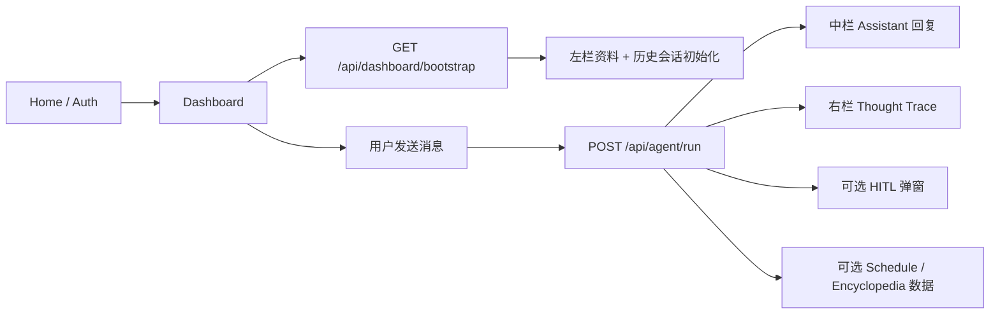

# Student Productivity Agent 后端开发 README

这份文档是给后端同学的中文 README。它不是纯接口字段表，而是面向“怎么把后端先做出来并和当前前端跑通”的实施说明。

如果你只想先看字段契约，请配合下面两份文档一起看：

- [backend-interface-contract-zh.md](./backend-interface-contract-zh.md)
- [backend-interface-contract.md](./backend-interface-contract.md)

## 1. 这份 README 解决什么问题

当前项目已经明确为：

- 前端：`PyQt6 / PySide6` 桌面端
- 后端：`RESTful API`
- 当前前端：可以本地 mock 运行，也可以切到真实后端

这份 README 主要回答 5 个问题：

1. 当前前端到底长什么样，后端需要配合哪些页面
2. 这一版后端最少要提供哪些接口
3. 每个接口前端什么时候调、怎么调、调完会怎么消费
4. 当前哪些功能先不用做，避免被“全量需求”拖住
5. 后端本地怎么快速起服务和前端联调

## 2. 当前前后端边界

### 2.1 当前页面流转

前端当前流程是：

1. `HomePage`
2. `AuthPage`
3. `DashboardPage`

其中：

- `HomePage` 是项目主页
- `AuthPage` 是登录 / 注册页
- `DashboardPage` 是登录后的主工作台

### 2.2 当前 Dashboard 长什么样

当前 Dashboard 已经调整成三栏结构：

- 左栏：工作区概览、历史对话、已读资料
- 中栏：主聊天窗口
- 右栏：`Thought Trace`

中栏当前是“聊天优先”设计：

- 用户所有请求都从一个聊天输入框进入
- 输入框下方有一个模式选择入口，可选：
  - `Chat`
  - `Schedule`
  - `Campus QA`
- `Schedule` 和 `Campus QA` 的结果不会作为独立主页面强依赖展示
- 它们会直接作为聊天结果卡片插入到主聊天流里

另外，顶部还有：

- 语言切换
- 设置按钮
- 刷新按钮
- 模拟 HITL 按钮
- 登出按钮

### 2.3 设置页和后端的关系

Dashboard 里的设置弹窗目前有两组配置：

- `CAS`：南科大统一认证账号密码
- `API`：外部模型 / 服务提供商的 `base_url` 和 `api_key`

这里有一个很重要的约定：

- 前端不会直接拿这两个配置去访问 CAS 或外部 API
- 前端只负责在运行期内保存它们
- 然后在 `POST /api/agent/run` 时，把它们作为 `connection_settings` 一起传给后端
- 具体怎么使用这两组配置，由后端决定

也就是说：

- “前端连后端”的地址，走环境变量 `SPA_API_BASE_URL`
- “后端再去调用 CAS / 第三方模型”的地址和 key，走用户在设置里填的 `connection_settings`

这两个概念不要混。

## 3. 当前最小可联调范围

### 3.1 这一版只要求 2 个核心接口

后端当前只需要先提供这两个接口：

1. `GET /api/dashboard/bootstrap`
2. `POST /api/agent/run`

原因很简单：

- 前端先要把主流程跑通
- 当前阶段不追求接口拆得特别细
- AI loop 很适合统一承接“用户输入 -> 推理 -> 工具 -> 结果回传”
- 页面初始化也很适合一次性 bootstrap

### 3.2 这版可以先不做什么

下面这些不是当前联调阻塞项：

- 登录 / 注册真实后端接口
- 单独文件上传接口
- 单独 schedule 刷新接口
- 单独 encyclopedia 查询接口
- 单独 HITL 审批接口
- 单独 trace 流式接口

说明：

- 当前登录 / 注册还是前端本地原型逻辑
- 也就是说，后端同学先不用被认证系统卡住
- 当前真正要打通的是“进入 Dashboard 后的数据初始化”和“AI loop 请求 / 响应”

## 4. 整体调用流程



## 5. 前端当前真实行为

这一节比较重要，因为它说的是“当前代码真的会怎么调用你”。

### 5.1 登录后会调用 bootstrap

当前前端在用户登录成功后，会：

1. 进入 Dashboard
2. 如果环境变量里配置了 `SPA_API_BASE_URL`
3. 立刻调用一次：

```http
GET /api/dashboard/bootstrap?user_id=<current_user_id>
```

其中：

- 现在的 `user_id` 暂时等于当前用户名
- 后续如果你们接正式认证，再换成数据库中的真实用户 ID 即可

### 5.2 发消息会调用 agent/run

当前用户在中栏聊天框点击发送后，前端会调用：

```http
POST /api/agent/run
```

请求里会带：

- `user_id`
- `session_id`
- `message`
- `context`
- `hitl_reply`
- `connection_settings`

### 5.3 当前 `active_tab` 固定是 `chat`

虽然早期原型里有多标签页设计，但当前 Dashboard 中栏已经精简成“只保留聊天区”。

因此当前前端实际发给后端的：

- `context.active_tab` 固定为 `chat`

但是：

- `context.selected_feature` 仍然有意义
- 当前前端优先由用户在输入框下方显式选择模式来决定路由

目前可能出现的 `selected_feature` 值包括：

- `agent_chat`
- `scheduler`
- `encyclopedia`
- `os_automation`

建议：

- 后端优先看 `selected_feature`
- 不要过度依赖 `active_tab`

补充说明：

- 当前模式选择比关键词识别优先级更高
- 也就是说，即使用户输入内容本身不明显，只要前端模式选的是 `scheduler`，后端就应该按日程能力来处理
- 唯一保留的特殊分支是高风险动作：如果请求明显涉及删除、覆盖、修改等高风险操作，前端仍可能把它发送为 `os_automation`

### 5.4 当前前端支持多会话

左侧“历史对话”已经是独立会话列表，不再是简单摘要。

所以：

- 每次新建聊天会生成新的 `session_id`
- 切换左侧历史会话时，前端会切换当前 `session_id`
- 后端如果需要维护上下文，可以把 `session_id` 当作会话键
- 如果后端暂时是无状态的，至少也建议把收到的 `session_id` 原样回传

### 5.5 HITL 回执复用同一个接口

当前前端在用户点了 HITL 弹窗的批准 / 拒绝之后，不会调用新接口，而是继续复用：

```http
POST /api/agent/run
```

这次的区别是：

- `message` 可能为空字符串
- `selected_feature` 会是 `os_automation`
- `hitl_reply` 不再是 `null`

## 6. 接口总览

| 接口 | 方法 | 用途 | 当前优先级 |
| --- | --- | --- | --- |
| `/api/dashboard/bootstrap` | `GET` | Dashboard 初始化数据 | 必做 |
| `/api/agent/run` | `POST` | AI loop 主入口，含 HITL 回执 | 必做 |

## 7. 通用约定

### 7.1 协议与格式

- 协议：HTTP
- 风格：RESTful
- 请求体格式：`application/json`
- 字符编码：`UTF-8`
- 时间格式：统一用 `ISO 8601`

示例：

```text
2026-03-21T20:00:00+08:00
```

### 7.2 响应建议

建议后端所有成功响应都返回 JSON 对象，而不是数组或纯文本。

当前前端的 REST 客户端有两个硬要求：

- 响应必须是合法 JSON
- JSON 顶层必须是对象

否则前端会直接把它视为异常。

### 7.3 鉴权头说明

这里有两个不同层面的鉴权，不要混淆：

#### A. 前端访问你们后端

如果前端运行时设置了：

```bash
export SPA_API_KEY=xxxx
```

那么前端会在请求头里加：

```http
Authorization: Bearer <SPA_API_KEY>
```

这个 token 是“桌面前端访问你们后端”的鉴权信息。

#### B. 用户在设置里填的外部 API 信息

如果用户在设置里保存了外部 API 配置，那么它会出现在：

```json
connection_settings.api
```

这个字段不是用来鉴权你们后端的，而是让你们后端在 AI loop 内部决定是否转发给第三方服务。

## 8. 接口一：`GET /api/dashboard/bootstrap`

### 8.1 作用

这个接口用于 Dashboard 初始化。

建议一次性返回：

- 用户资料
- 聊天历史
- 已读资料
- 本地日程缓存

### 8.2 请求示例

```http
GET /api/dashboard/bootstrap?user_id=student
```

### 8.3 推荐返回结构

```json
{
  "user_profile": {
    "user_id": "student",
    "display_name": "SUSTech Student",
    "major": "Software Engineering",
    "preferences": {
      "theme": "cosmic",
      "language": "en"
    }
  },
  "chat_history": [
    {
      "message_id": "msg_001",
      "role": "assistant",
      "content": "Welcome back. I can help you manage campus tasks.",
      "timestamp": "2026-03-21T19:50:00+08:00"
    },
    {
      "message_id": "msg_002",
      "role": "user",
      "content": "Please check my schedule conflicts for this week.",
      "timestamp": "2026-03-21T19:51:00+08:00"
    }
  ],
  "materials": [
    {
      "file_id": "file_101",
      "file_name": "week5_notes.md",
      "file_type": "text/markdown",
      "vectorized": false,
      "uploaded_at": "2026-03-21T18:00:00+08:00"
    },
    {
      "file_id": "file_102",
      "file_name": "student_handbook_2026.pdf",
      "file_type": "application/pdf",
      "vectorized": true,
      "uploaded_at": "2026-03-20T21:00:00+08:00"
    }
  ],
  "local_schedule": {
    "events": [
      {
        "event_id": "evt_001",
        "title": "CS304 Team Meeting",
        "time": "Mon 19:00 - 20:30",
        "source": "Local TODO",
        "detail": "Finalize API contract and UI handoff."
      }
    ],
    "conflicts": [
      {
        "title": "OOAD report overlaps with lab preparation",
        "detail": "Deadline is 30 minutes before a fixed lab block on Thursday."
      }
    ]
  }
}
```

### 8.4 前端怎么消费这个返回

#### `user_profile`

前端当前重点使用：

- `display_name`
- `major`

如果这两个字段缺失，前端会回退到本地默认文案。

#### `chat_history`

前端会把它直接灌进当前激活会话。

需要注意：

- `role = user` 会映射为用户消息
- 其他值会被当成助手消息

所以建议后端严格只返回：

- `user`
- `assistant`

#### `materials`

前端左栏“已读资料”当前主要用：

- `file_name`

也就是说，这一版即使你只先返回文件名，也足够前端展示。

#### `local_schedule`

虽然当前中栏可见 UI 已精简为聊天区，但前端内部仍然保留了：

- `schedule_events`
- `conflicts`

所以建议这个字段先照契约返回，不要删。

### 8.5 实施建议

为了后端先跑通，你可以先这样实现：

- `user_profile` 从数据库查
- `chat_history` 先查最近 N 条会话消息
- `materials` 先查用户最近上传 / 已处理资料
- `local_schedule` 先返回空对象或 mock

比如第一版完全可以返回：

```json
{
  "user_profile": {
    "user_id": "student",
    "display_name": "student",
    "major": "Software Engineering"
  },
  "chat_history": [],
  "materials": [],
  "local_schedule": {
    "events": [],
    "conflicts": []
  }
}
```

前端一样能进主界面。

## 9. 接口二：`POST /api/agent/run`

### 9.1 作用

这是当前后端最重要的接口。

它统一承接：

- 普通聊天
- AI loop 推理结果回传
- trace 更新
- schedule 数据返回
- encyclopedia 数据返回
- HITL 拦截
- HITL 批准 / 拒绝回执

对于当前前端来说，这个接口的结果会优先驱动聊天流本身：

- `assistant_message` 会变成普通聊天回复
- `ui_payload.schedule` 会变成聊天中的日程结果卡片
- `ui_payload.encyclopedia` 会变成聊天中的校园问答结果卡片
- `trace` 会继续显示在右侧 `Thought Trace`

### 9.2 请求结构

```json
{
  "user_id": "student",
  "session_id": "sess_20260321_01",
  "message": "Check whether my Blackboard deadlines conflict with lab time.",
  "attachments": [],
  "context": {
    "active_tab": "chat",
    "selected_feature": "scheduler"
  },
  "hitl_reply": null,
  "connection_settings": {
    "cas": {
      "username": "1221xxxx",
      "password": "example-password"
    },
    "api": {
      "base_url": "https://api.example.com",
      "api_key": "example-api-key"
    }
  }
}
```

### 9.3 请求字段说明

#### `user_id`

- 当前用户标识
- 现在通常等于用户名

#### `session_id`

- 当前会话 ID
- 用于区分左侧不同历史对话

#### `message`

- 用户本次输入的自然语言请求
- 如果当前是在回 HITL，可能为空字符串

#### `attachments`

- 当前前端骨架里通常为空数组
- 后续如果接文件上传，可以继续沿用这个字段

#### `context.active_tab`

- 当前前端固定为 `chat`
- 当前这版前端没有让用户在主工作区里切换独立业务 tab

#### `context.selected_feature`

当前前端可能传：

- `agent_chat`
- `scheduler`
- `encyclopedia`
- `os_automation`

来源说明：

- `agent_chat / scheduler / encyclopedia` 来自聊天输入框下方的模式选择
- `os_automation` 主要用于高风险动作和 HITL 继续执行流程

#### `hitl_reply`

两种情况：

- 普通对话时：`null`
- 用户确认 / 拒绝高风险操作时：对象

示例：

```json
{
  "request_id": "hitl_9001",
  "approved": true
}
```

#### `connection_settings`

这个字段是给后端用的。

可能为：

- `null`
- 只包含 `cas`
- 只包含 `api`
- 同时包含 `cas` 和 `api`

示例：

```json
{
  "cas": {
    "username": "1221xxxx",
    "password": "example-password"
  },
  "api": {
    "base_url": "https://api.example.com",
    "api_key": "example-api-key"
  }
}
```

当前语义是：

- 前端只负责把用户在设置里保存的配置转发给后端
- 后端自行决定是否使用、如何加密、如何缓存、是否写库

### 9.4 推荐返回结构

```json
{
  "session_id": "sess_20260321_01",
  "assistant_message": {
    "role": "assistant",
    "content": "I found a conflict on Thursday 16:00. Please review the suggested adjustment.",
    "timestamp": "2026-03-21T20:00:00+08:00"
  },
  "trace": [
    {
      "phase": "Observation",
      "title": "Read user goal",
      "detail": "Need a schedule conflict check.",
      "status": "done",
      "timestamp": "2026-03-21T19:59:58+08:00"
    },
    {
      "phase": "Reasoning",
      "title": "Plan tool sequence",
      "detail": "Blackboard scraper -> merge local calendar -> detect overlap.",
      "status": "done",
      "timestamp": "2026-03-21T19:59:59+08:00"
    }
  ],
  "route": "scheduler",
  "ui_payload": {
    "schedule": {
      "events": [
        {
          "title": "Blackboard Deadline: OOAD Report",
          "time": "Thu 15:30",
          "source": "Blackboard",
          "detail": "Upload final report before the submission closes."
        }
      ],
      "conflicts": [
        {
          "title": "OOAD report overlaps with lab preparation",
          "detail": "Deadline is 30 minutes before a fixed lab block on Thursday."
        }
      ]
    },
    "encyclopedia": null
  },
  "hitl_request": null,
  "error": null
}
```

### 9.5 返回字段说明

#### `session_id`

建议后端把请求里的 `session_id` 原样返回。

#### `assistant_message`

前端当前主要使用：

- `assistant_message.content`

如果内容为空，前端就不会新增一条助手消息。

#### `trace`

前端右栏会直接追加展示这些 trace。

推荐每个元素包含：

- `phase`
- `title`
- `detail`
- `status`

其中 `status` 推荐只用：

- `done`
- `running`
- `pending`

#### `route`

推荐值：

- `chat`
- `scheduler`
- `encyclopedia`

当前前端不会强依赖这个字段做页面跳转，但它仍然是很好的调试语义。

更准确地说：

- 当前前端不会因为 `route` 去切换独立页面
- 它会继续停留在主聊天流里
- 但 `route` 仍然能帮助我们判断当前回复属于普通对话、日程能力还是校园问答能力

#### `ui_payload`

建议固定保留两个槽位：

- `ui_payload.schedule`
- `ui_payload.encyclopedia`

即使其中一个为 `null` 也没关系。

当前前端消费方式：

- `ui_payload.schedule`：插入聊天里的日程摘要卡片
- `ui_payload.encyclopedia`：插入聊天里的校园问答卡片

#### `hitl_request`

当后端判断用户请求属于高风险动作时，不要直接执行，而是返回这个对象，让前端弹窗询问用户。

### 9.6 Encyclopedia 返回格式

如果当前命中了百科 / RAG 路径，建议这样返回：

```json
{
  "route": "encyclopedia",
  "ui_payload": {
    "schedule": null,
    "encyclopedia": {
      "query": "credit requirements",
      "answer_markdown": "### Credit Requirement Summary\n- ...",
      "citations": [
        "Student Handbook / Degree Requirements / General Rules"
      ]
    }
  }
}
```

### 9.7 HITL 返回格式

当你需要前端弹出授权框时，建议返回：

```json
{
  "session_id": "sess_20260321_01",
  "assistant_message": {
    "role": "assistant",
    "content": "This action requires manual approval before execution.",
    "timestamp": "2026-03-21T20:05:00+08:00"
  },
  "trace": [
    {
      "phase": "Tool Use",
      "title": "Awaiting authorization",
      "detail": "Calendar overwrite is classified as a high-risk action.",
      "status": "pending",
      "timestamp": "2026-03-21T20:05:00+08:00"
    }
  ],
  "route": "chat",
  "ui_payload": {
    "schedule": null,
    "encyclopedia": null
  },
  "hitl_request": {
    "request_id": "hitl_9001",
    "action": "Overwrite local study calendar",
    "risk": "high",
    "reason": "The agent wants to move three study blocks to avoid a deadline collision.",
    "payload": [
      "Move OOAD report reminder from Thu 15:00 to Wed 21:00",
      "Move lab preparation from Thu 14:00 to Thu 12:30"
    ]
  },
  "error": null
}
```

### 9.8 HITL 回执请求示例

当前前端在用户点了批准 / 拒绝之后，会再次请求：

```json
{
  "user_id": "student",
  "session_id": "sess_20260321_01",
  "message": "",
  "attachments": [],
  "context": {
    "active_tab": "chat",
    "selected_feature": "os_automation"
  },
  "hitl_reply": {
    "request_id": "hitl_9001",
    "approved": true
  },
  "connection_settings": {
    "cas": {
      "username": "1221xxxx",
      "password": "example-password"
    }
  }
}
```

后端收到后可以：

- 真正执行高风险动作
- 或记录拒绝状态
- 然后仍然返回标准的 `assistant_message + trace + ui_payload + hitl_request`

## 10. 当前前端对字段的容错情况

这一节对后端落地很有帮助，因为它说明哪些字段你们可以先简化。

### 10.1 bootstrap 的容错

前端当前允许：

- `chat_history = []`
- `materials = []`
- `local_schedule.events = []`
- `local_schedule.conflicts = []`

也就是说，第一版后端完全可以先返回空列表。

### 10.2 agent/run 的容错

前端当前允许：

- `assistant_message.content` 为空
- `trace = []`
- `ui_payload.schedule = null`
- `ui_payload.encyclopedia = null`
- `hitl_request = null`

所以你们可以先从最小返回开始逐步加功能。

### 10.3 前端不喜欢什么

前端当前不喜欢这些情况：

- 响应不是 JSON
- JSON 顶层不是对象
- HTTP 层直接断开且没有返回

因为这些会直接走错误分支，右侧 trace 只会显示“后端不可用”。

## 11. HTTP 状态码和错误处理建议

建议：

- `200`：业务成功，哪怕结果为空
- `400`：请求体缺字段 / 参数非法
- `401`：前端访问后端未授权
- `403`：用户无权限
- `422`：字段格式对但业务不可处理
- `500`：后端内部异常

如果失败，建议仍尽量返回 JSON，例如：

```json
{
  "error": {
    "code": "INVALID_SESSION",
    "message": "session_id is missing or expired"
  }
}
```

当前前端虽然不会完整消费这个结构，但后续调试会方便很多。

## 12. 后端实现建议

### 12.1 推荐先做最小骨架

如果你们用 `FastAPI`，建议最小结构类似：

```text
backend/
  app.py
  routers/
    dashboard.py
    agent.py
  schemas/
    dashboard.py
    agent.py
  services/
    ai_loop.py
    trace_builder.py
    schedule_service.py
    rag_service.py
    hitl_service.py
  repositories/
    user_repo.py
    chat_repo.py
    material_repo.py
```

建议第一步就先把两个接口空跑通：

- `GET /api/dashboard/bootstrap`
- `POST /api/agent/run`

只要前端能收到合法 JSON，对接就已经迈出最大的一步。

### 12.2 推荐的最小开发顺序

建议按这个顺序做：

1. 起一个能返回固定 JSON 的 `bootstrap`
2. 起一个能返回固定 JSON 的 `agent/run`
3. 让前端切到 `SPA_API_BASE_URL` 后能真正显示后端返回
4. 再把 AI loop、数据库、RAG、调度工具逐步换成真实实现

### 12.3 为什么不建议一开始就做流式接口

因为当前前端这版用的是简单 REST 客户端，不是 websocket / SSE。

所以建议这轮先把：

- 单次请求
- 单次完整响应

先走通。后续如果要做流式 trace，再单独扩展。

## 13. 本地联调方式

### 13.1 前端如何连接你们后端

在前端机器上设置：

```bash
export SPA_API_BASE_URL=http://127.0.0.1:8000
python3 frontend/app.py
```

如果你们后端要求 Bearer Token，再加：

```bash
export SPA_API_KEY=your-backend-token
```

### 13.2 bootstrap 联调命令

```bash
curl "http://127.0.0.1:8000/api/dashboard/bootstrap?user_id=student"
```

### 13.3 agent/run 联调命令

```bash
curl -X POST "http://127.0.0.1:8000/api/agent/run" \
  -H "Content-Type: application/json" \
  -d '{
    "user_id": "student",
    "session_id": "sess_demo_001",
    "message": "Check my Blackboard deadlines and explain the conflict.",
    "attachments": [],
    "context": {
      "active_tab": "chat",
      "selected_feature": "scheduler"
    },
    "hitl_reply": null,
    "connection_settings": {
      "cas": {
        "username": "1221xxxx",
        "password": "example-password"
      },
      "api": {
        "base_url": "https://api.example.com",
        "api_key": "example-api-key"
      }
    }
  }'
```

## 14. 第一版“能跑就行”的返回模板

如果你们想最快和前端通一次，下面这两个极简返回就够用了。

### 14.1 bootstrap 极简返回

```json
{
  "user_profile": {
    "user_id": "student",
    "display_name": "student",
    "major": "Software Engineering"
  },
  "chat_history": [],
  "materials": [],
  "local_schedule": {
    "events": [],
    "conflicts": []
  }
}
```

### 14.2 agent/run 极简返回

```json
{
  "session_id": "sess_demo_001",
  "assistant_message": {
    "role": "assistant",
    "content": "Backend connected successfully.",
    "timestamp": "2026-03-21T20:00:00+08:00"
  },
  "trace": [
    {
      "phase": "Observation",
      "title": "Request received",
      "detail": "The backend has accepted the chat request.",
      "status": "done",
      "timestamp": "2026-03-21T20:00:00+08:00"
    }
  ],
  "route": "chat",
  "ui_payload": {
    "schedule": null,
    "encyclopedia": null
  },
  "hitl_request": null,
  "error": null
}
```

这两个接口只要先按上面返回，前端就能明显看出“不是 mock，而是真的连上后端了”。

## 15. 后端联调检查清单

联调前，请至少确认下面这些点：

- `GET /api/dashboard/bootstrap` 能返回 JSON 对象
- `POST /api/agent/run` 能返回 JSON 对象
- `Content-Type` 为 `application/json`
- `session_id` 会原样回传
- `assistant_message.content` 是字符串
- `trace` 是数组
- `ui_payload` 顶层存在
- `hitl_request` 没触发时返回 `null`
- 时间字段统一使用 `ISO 8601`
- 不要把 `local_schedule` 返回成数组，应该是对象 `{ events, conflicts }`
- 不要把 `connection_settings` 误当成前端访问后端的鉴权参数

## 16. 当前已知约定和后续演进

### 16.1 当前登录注册仍是本地逻辑

这一版前端的登录 / 注册只是原型，不依赖后端。

所以当前后端 README 没把认证接口放进必做项里。

### 16.2 当前设置只是运行期内保存

用户在前端设置里填写的：

- CAS 用户名 / 密码
- 外部 API `base_url / api_key`

当前只在前端运行期内保存，并随 `agent/run` 转发给后端，不会长期持久化。

如果后端后续需要落库、加密、脱敏、过期管理，请自行设计。

### 16.3 后续可以再拆更多接口

等这一版稳定后，后续可以再拆：

- 登录 / 注册真实接口
- 文件上传接口
- 单独百科搜索接口
- 单独 schedule 刷新接口
- SSE / websocket trace 流接口

但当前不建议一开始就拆这么细。

## 17. 一句话总结

后端当前只要先把下面两件事做好，前端就能真正联起来：

1. `GET /api/dashboard/bootstrap` 返回 Dashboard 初始化数据
2. `POST /api/agent/run` 返回 AI loop 的聊天结果、trace、可选 HITL 和可选业务数据

先跑通，再细化，是这版最稳的推进方式。
